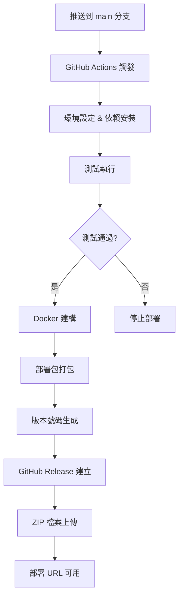

# Deployment Guide (DG) - OCI Vosk STT API 一鍵部署

## 🎯 概述

本指南提供 OCI Vosk Speech-to-Text API 服務的完整一鍵部署說明。使用者可透過 README.md 中的 "Deploy to Oracle Cloud" 按鈕，直接在 OCI 控制台中完成部署，無需手動上傳檔案或複雜設定。

## 1. 部署前準備

### 1.1 OCI 帳號需求
- **OCI 帳號**: 免費或付費帳號均可
- **Free Tier 支援**: 完全支援 OCI Free Tier (推薦 A1.Flex)
- **權限需求**: 
  - 建立計算實例
  - 管理 VCN 和子網路
  - 配置安全規則
  - 使用 Resource Manager

### 1.2 必要資訊準備
- **SSH 公鑰**: 用於安全存取實例 ([生成教學](#ssh-金鑰生成))
- **API 金鑰**: 16+ 字元的安全金鑰 (例如: `my-secure-api-key-2024`)
- **Compartment**: 目標部署區間
- **區域**: 偏好的 OCI 區域

## 2. 一鍵部署流程

### 2.1 使用 Deploy to Oracle Cloud 按鈕

1. **點擊部署按鈕**
   ```
   前往專案 README.md → 點擊 "Deploy to Oracle Cloud" 按鈕
   ```

2. **自動導引至 OCI**
   - 自動開啟 OCI Resource Manager 建立堆疊頁面
   - 自動載入最新版本的部署包
   - 無需手動上傳或下載檔案

### 2.2 OCI 控制台設定流程

#### 第一步：基本資訊
- **名稱**: 輸入堆疊名稱 (例如: `vosk-stt-api`)
- **描述**: 自動填入專案描述
- **Compartment**: 選擇目標區間

#### 第二步：參數配置

**🔧 必要配置**
- **Compartment**: 選擇部署目標區間
- **Availability Domain**: 選擇可用性網域 (任一即可)
- **SSH Public Key**: 貼上您的 SSH 公鑰
- **API Key**: 輸入安全的 API 金鑰 (最少 16 字元)

**💻 實例配置**
- **Instance Shape**: 選擇計算實例規格
  - 🆓 **Free Tier 推薦**: `VM.Standard.A1.Flex`
  - 💰 **付費選項**: `VM.Standard.E3.Flex`, `VM.Standard.E4.Flex`
- **OCPUs**: 選擇 OCPU 數量 (僅彈性規格)
  - Free Tier A1.Flex: 最多 4 OCPU 免費
- **Memory (GB)**: 選擇記憶體大小 (僅彈性規格)
  - Free Tier A1.Flex: 最多 24 GB 免費

**🌐 網路配置**
- **Create New VCN**: 保持勾選 (推薦，自動建立完整網路)
- **Existing VCN**: 如使用現有網路，取消勾選並選擇
- **Existing Subnet**: 如使用現有子網路

#### 第三步：部署執行
1. 檢查所有設定
2. 點擊 **"Create"** 開始部署
3. 等待 5-10 分鐘完成部署

## 3. 自動化 CI/CD 架構

### 3.1 GitHub Actions 工作流程



### 3.2 自動化功能特色

**🔄 品質保證**
- 自動執行完整測試套件
- 測試失敗時自動停止部署
- 程式碼品質檢查

**📦 部署包自動化**
- 自動包含所有必要檔案
- 符合 OCI Resource Manager 標準
- 版本化管理 (基於時間戳記)

**🚀 一鍵整合**
- 自動更新部署 URL
- 支援 `/latest/download` 動態連結
- 無需手動維護版本號碼

### 3.3 部署包結構

```
vosk-stt-api-deployment.zip
├── schema.yaml              # OCI UI 表單定義
├── main.tf                  # Terraform 基礎設施程式碼
├── variables.tf             # 變數定義與驗證
├── cloud-init.yaml          # 實例初始化腳本
├── POST_DEPLOYMENT.md       # 部署後使用指南
├── api/                     # 完整應用程式源碼
│   ├── main.py
│   ├── auth.py
│   ├── tasks.py
│   ├── stt.py
│   └── ...
├── tests/                   # 自動化測試套件
├── requirements.txt         # Python 依賴清單
├── Dockerfile              # 容器建構檔案
└── README.md               # 專案說明文檔
```

## 4. 部署後操作指南

### 4.1 取得部署資訊

部署完成後，在 OCI Resource Manager 的 **"Job details"** → **"Outputs"** 中可找到：

```json
{
  "instance_public_ip": "192.168.1.100",
  "api_url": "http://192.168.1.100:8000",
  "api_docs_url": "http://192.168.1.100:8000/docs", 
  "ssh_command": "ssh opc@192.168.1.100",
  "logs_command": "sudo tail -f /var/log/vosk-stt-deployment.log"
}
```

### 4.2 服務驗證步驟

#### 1. 健康檢查
```bash
curl http://YOUR_INSTANCE_IP:8000/health
# 預期回應: {"status": "ok"}
```

#### 2. API 金鑰驗證
```bash
curl -H "x-api-key: YOUR_API_KEY" \
     http://YOUR_INSTANCE_IP:8000/models
# 預期回應: 支援的語言和模型列表
```

#### 3. 上傳測試檔案
```bash
curl -X POST \
     -H "x-api-key: YOUR_API_KEY" \
     -F "file=@test_audio.wav" \
     -F "language=en" \
     -F "model_size=small" \
     http://YOUR_INSTANCE_IP:8000/transcribe
# 預期回應: {"task_id": "...", "status": "queued"}
```

### 4.3 服務監控與除錯

#### SSH 連接實例
```bash
ssh opc@YOUR_INSTANCE_IP
```

#### 查看部署日誌
```bash
# 主要部署日誌
sudo tail -f /var/log/vosk-stt-deployment.log

# Docker 容器日誌
docker logs vosk-stt-api

# 即時監控
docker logs -f vosk-stt-api
```

#### 檢查服務狀態
```bash
# 檢查容器狀態
docker ps

# 檢查資源使用
docker stats vosk-stt-api

# 檢查埠口
sudo netstat -tlnp | grep :8000
```

## 5. Free Tier 最佳化配置

### 5.1 推薦配置

| 用途 | Instance Shape | OCPU | 記憶體 | 成本 |
|------|---------------|------|-------|------|
| 測試開發 | A1.Flex | 1 | 6 GB | 免費 |
| 一般使用 | A1.Flex | 2 | 8 GB | 免費 |
| 生產環境 | A1.Flex | 4 | 16 GB | 免費 |

### 5.2 效能最佳化建議

**記憶體使用優化**：
- Small 模型：建議 6-8 GB RAM
- Large 模型：建議 12-16 GB RAM
- 多並發處理：每額外並發 +2 GB RAM

**ARM 處理器優勢**：
- A1.Flex 使用 ARM Ampere 處理器
- 相比 x86 具有更好的能效比
- 同等記憶體下性能更優

## 6. 網路與安全架構

### 6.1 自動網路配置

**VCN 自動建立** (當選擇 "Create New VCN" 時)：
- VCN CIDR: `10.0.0.0/16`
- 子網路 CIDR: `10.0.1.0/24`  
- 網際網路閘道: 自動建立
- 路由表: 自動配置

**安全規則自動開放**：
- SSH (22): 實例管理存取
- API (8000): STT API 服務 (HTTP)

**預備端口** (暫不使用)：
- HTTP (80): 預備給未來 Web 介面
- HTTPS (443): 預備給未來 SSL 升級

### 6.2 個人使用安全建議

**API 金鑰管理**：
- 最少 16 字元長度
- 建議使用英數字組合
- 僅在個人設備上使用
- 避免在公共網路上使用

**SSH 存取安全**：
- 僅支援金鑰認證 (無密碼登入)
- 建議使用 ED25519 或 RSA 4096 金鑰
- 私鑰妥善保存在本地

**網路使用建議**：
- ✅ 家庭網路、私人 VPN
- ✅ 內部開發環境
- ⚠️ 避免公共 WiFi
- ⚠️ 不適合生產環境公開服務

## 7. 常見問題與解決方案

### 7.1 部署相關問題

**Q: 部署失敗，顯示 "超出 Free Tier 限制"**
```
A: 檢查以下設定：
   - A1.Flex OCPU ≤ 4
   - A1.Flex 記憶體 ≤ 24 GB
   - 確認其他資源未超出限制
```

**Q: 部署成功但 API 無法存取**
```
A: 檢查步驟：
   1. 確認實例狀態為 "Running"
   2. 檢查安全規則是否開放 8000 埠
   3. 等待 2-3 分鐘讓服務完全啟動
   4. 檢查部署日誌是否有錯誤
```

**Q: SSH 連接被拒絕**
```
A: 可能原因：
   1. SSH 公鑰格式錯誤
   2. 使用錯誤的使用者名稱 (應為 'opc')
   3. 安全組未開放 22 埠
   4. 實例尚未完全啟動
```

### 7.2 服務運行問題

**Q: API 回應 "模型載入失敗"**
```
A: 解決步驟：
   1. SSH 到實例檢查磁碟空間
   2. 檢查網路連接是否正常
   3. 手動重啟容器: docker restart vosk-stt-api
   4. 檢查日誌了解詳細錯誤
```

**Q: 記憶體不足錯誤**
```
A: 優化建議：
   1. 升級到更大記憶體配置
   2. 使用 small 模型而非 large
   3. 限制同時處理的任務數量
   4. 重啟服務釋放記憶體
```

### 7.3 SSH 金鑰生成

#### Linux/macOS:
```bash
# 生成 ED25519 金鑰 (推薦)
ssh-keygen -t ed25519 -C "your_email@example.com"

# 或生成 RSA 4096 金鑰
ssh-keygen -t rsa -b 4096 -C "your_email@example.com"

# 查看公鑰 (複製到 OCI 設定中)
cat ~/.ssh/id_ed25519.pub
```

#### Windows (PowerShell):
```powershell
# 生成金鑰
ssh-keygen -t ed25519 -C "your_email@example.com"

# 查看公鑰
Get-Content ~\.ssh\id_ed25519.pub
```

## 8. 清理與移除

### 8.1 完整移除服務

在 OCI Resource Manager 中：
1. 前往 **"Stacks"** 找到您的堆疊
2. 點擊堆疊名稱進入詳細頁面
3. 點擊 **"Destroy"** 按鈕
4. 確認移除操作
5. 等待所有資源被自動清理

### 8.2 注意事項

- Terraform 會自動移除所有相關資源
- 包括實例、VCN、安全規則等
- 不會影響其他服務或資源
- 移除完成後不會產生任何費用

---

## 📚 延伸閱讀

- [OCI Free Tier 說明](https://www.oracle.com/cloud/free/)
- [OCI Resource Manager 文檔](https://docs.oracle.com/en-us/iaas/Content/ResourceManager/home.htm)
- [Terraform OCI Provider](https://registry.terraform.io/providers/oracle/oci/latest/docs)
- [Vosk 語音辨識文檔](https://alphacephei.com/vosk/)

**🎉 恭喜！您已成功部署 Vosk STT API 服務！**